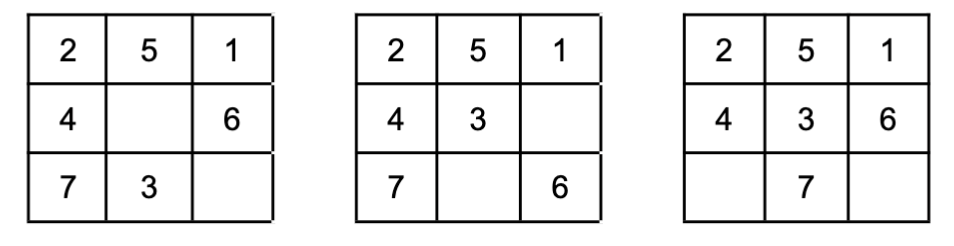

# Artificial Intelligence Project: A* on the 7-tile Puzzle
## Assignement Goals
* Deepen understanding of state space generation.
* Practice implementation of an efficient search algorithm.
## Summary 
* This assignment is about solving a variant of the 8-tile puzzle. The 8-tile puzzle was invented and popularized by Noyes Palmer Chapman in the 1870s. The version we will consider in this homework is played on a 3x3 grid with 7 tiles labeled 1 through 7 and two empty grids. The goal is to rearrange the tiles so that they are in order and the empty places are at the bottom right.
* You solve the puzzle by moving the tiles around. For each step, **you can only move one (not more!)** of the neighbor tiles (**left, right, top, bottom but not diagonally**) into an empty grid. And all tiles must stay in the 3x3 grid (so no wrap around allowed). An example is shown in the picture below. Suppose we start from the following configuration:

* Then, moving one tile can result in one of the following:

* That is, in the above example, we would either move 3 or 6 down or move 7 to the right. Given these rules for the puzzle, you will generate a state space and solve this puzzle using the A* search algorithm.
## Program Specification
* The code for this program should be written in Python, in a file called funny_puzzle.py. We will provide states in a one-dimensional list of integers, with the empty spaces represented as 0. For example, in the picture above, the initial state is represented by [2,5,1,4,3,6,7,0,0] and its successors are [2,5,1,4,0,6,7,3,0],[2,5,1,4,3,0,7,0,6],[2,5,1,4,3,6,0,7,0].
* In this assignment, you will need a priority queue. We highly recommend using the package `heapq` for the implementation. You should refer to [<span style="color:blue">heapq</span>](https://docs.python.org/3/library/heapq.html) if you are not familiar with it.
## Goal State
* The goal state of the puzzle is [1, 2, 3, 4, 5, 6, 7, 0, 0], or visually:

* Something to think about (not graded): Prove that every starting configuration is solvable.
## Heuristic
* Since we are using the A* search algorithm, we need a heuristic function `h(s)`. Recall the Manhattan distance mentioned in lecture (the l1-norm). We will use the sum of Manhattan distance of each tile toits goal position as our heuristic function. The Manhattan distance of two tiles in this case is the absolute difference between their x coordinates plus the absolute distance between their y coordinates.
* In our first example puzzle ([2,5,1,4,3,6,7,0,0]), the `h()` is 6. This is computed by calculating the Manhattan distance of each title and summing them. Specifically, tiles 4/6/7 are already in place,thus they have 0 distances. Tile 1 has a Manhattan distance of 2 (manhattan([0,2], [0,0]) = abs(0-0) + abs(2-0) = 2), tiles 2/3/5 have distances of 1/2/1, respectively.
* **Caution:** do not count the distance of tiles '0' since they are actually not tiles but are empty sections.
## Functions
* For this program you need to write two (2) Python functions:
1. `print_succ(state)` - given a state of the puzzle, represented as a single list of integers with a 0 in the empty spaces, print to the console all of the possible successor states.
2. `solve(state)` - given a state of the puzzle, perform the A* search algorithm and print the path from the current state to the goal state.
* You may, of course, add any other functions you see fit, but these two functions must be present and work as described here.
## Print Successors
* This function should print out the successor states of the initial state, as well as their heuristic value according to the function described above. The number of successor states depends on the current state.
```python
print_succ([2,5,1,4,0,6,7,0,3])
```
[2, 0, 1, 4, 5, 6, 7, 0, 3] h=5

[2, 5, 1, 0, 4, 6, 7, 0, 3] h=7

[2, 5, 1, 4, 0, 6, 0, 7, 3] h=7

[2, 5, 1, 4, 0, 6, 7, 3, 0] h=7

[2, 5, 1, 4, 6, 0, 7, 0, 3] h=7

* **We do require that these be printed in a specific order:** if you consider the state to be a nine-digit integer, the states should be sorted in ascending order. Conveniently, if you ask Python to sort one-dimensional arrays, it will adhere to this order by default; don't do more work than you have to:
```python
lists = [[2, 0, 1, 4, 5, 6, 7, 0, 3],
        [2, 5, 1, 4, 6, 0, 7, 0, 3]
        [2, 5, 1, 4, 0, 6, 7, 3, 0],
        [2, 5, 1, 4, 0, 6, 0, 7, 3],
        [2, 5, 1, 0, 4, 6, 7, 0, 3]]
sorted(lists)
```
[[2, 0, 1, 4, 5, 6, 7, 0, 3], [2, 5, 1, 0, 4, 6, 7, 0, 3], [2, 5, 1, 4, 0, 6,0, 7, 3], [2, 5, 1, 4, 0, 6, 7, 3, 0], [2, 5, 1, 4, 6, 0, 7, 0, 3]]

## Priority Queue
* Now is a good time to implement the priority queue in your code. We recommend you use the python library `heapq` to create your priority queue. Here is a quick example:
```python
import heapq
pq = []
heapq.heappush(pq,(5, [1, 2, 3, 4, 5, 0, 6, 7, 0], (0, 5, -1)))
print(pq)
```
[(5, [1, 2, 3, 4, 5, 0, 6, 7, 0], (0, 5, -1))]
* The code will push an item([1, 2, 3, 4, 5, 0, 6,7, 0], (0, 5, -1)) with priority 5 into the queue. It would be useful to do pushes of the form
```python
heapq.heappush(pq ,(cost, state, (g, h, parent_index)))
```
* where pq is the priority queue, g and h are the values of the functions that we defined in Search II slides (g is the cost from the starting node, which in our case will be the number of moves so far, and his the value of the heuristic function) and cost=g+h (this is what we want to use as priority). A parent index of -1 denotes the initial state, without any parent. For more details, please [<span style="color:blue">refer to the documentation of heapq</span>](https://docs.python.org/3/library/heapq.html).
* To get the final path, for each element in the priority queue we need to remember its parent state. Remember to store the state when you pop it from the priority queue, so you could refer to it later when you generate the final path. Here is how you can pop from a priority queue
```python
b = heapq.heappop(pq)
print(b)
```
(5, [1, 2, 3, 4, 5, 0, 6, 7, 0], (0, 5, -1))
```python
print(pq)
```
[]
* The priority queue is stored in a list and, for debugging, you can print its items (with the associated priority) by using
```python
# assume that you have generated and enqueued the successors
print(*pq, sep='\n')
```
(7, [1, 2, 0, 4, 5, 3, 6, 7, 0], (1, 6, 0))

(7, [1, 2, 3, 4, 0, 5, 6, 7, 0], (1, 6, 0))

(7, [1, 2, 3, 4, 5, 0, 6, 7, 0], (1, 6, 0))
* Note that the `heappush` maintains the priority in ascending order, i.e.,`heappop` will always pop the element with the smallest priority. We require that the states with the same cost (priority) to be popped in a specific order: if you consider the state to be a nine-digit integer, the states should be sorted in ascending order - just like we mentioned above. If you follow the format in `pq` as shown above, `heapq` will automatically take care of this and you do not need more work.
## Solve the Puzzle
* This function should print the solution path from the provided initial state to the goal state, along with the heuristic values of each intermediate state according to the function described above, and total moves taken to reach the state. Recall that our cost function g(n) is the total number of moves so far, and every valid successor has an additional cost of 1.
```python
solve([4,3,0,5,1,6,7,2,0])
```
[4, 3, 0, 5, 1, 6, 7, 2, 0] h=7 moves: 0

[4, 0, 3, 5, 1, 6, 7, 2, 0] h=6 moves: 1

[4, 1, 3, 5, 0, 6, 7, 2, 0] h=5 moves: 2

[4, 1, 3, 0, 5, 6, 7, 2, 0] h=4 moves: 3

[0, 1, 3, 4, 5, 6, 7, 2, 0] h=3 moves: 4

[0, 1, 3, 4, 5, 0, 7, 2, 6] h=4 moves: 5

[0, 1, 3, 4, 0, 5, 7, 2, 6] h=5 moves: 6

[0, 1, 3, 4, 2, 5, 7, 0, 6] h=4 moves: 7

[1, 0, 3, 4, 2, 5, 7, 0, 6] h=3 moves: 8

[1, 2, 3, 4, 0, 5, 7, 0, 6] h=2 moves: 9

[1, 2, 3, 4, 5, 0, 7, 0, 6] h=1 moves: 10

[1, 2, 3, 4, 5, 6, 7, 0, 0] h=0 moves: 11

Max queue length: 163
## Additional Hints
* To reduce runtime, it is recommended that you don't explore any state that has been visited before. To do this, you can use a set to track which states have been visited already. Ensure that your solution does not take more than 30 seconds to run on each of the given instances.